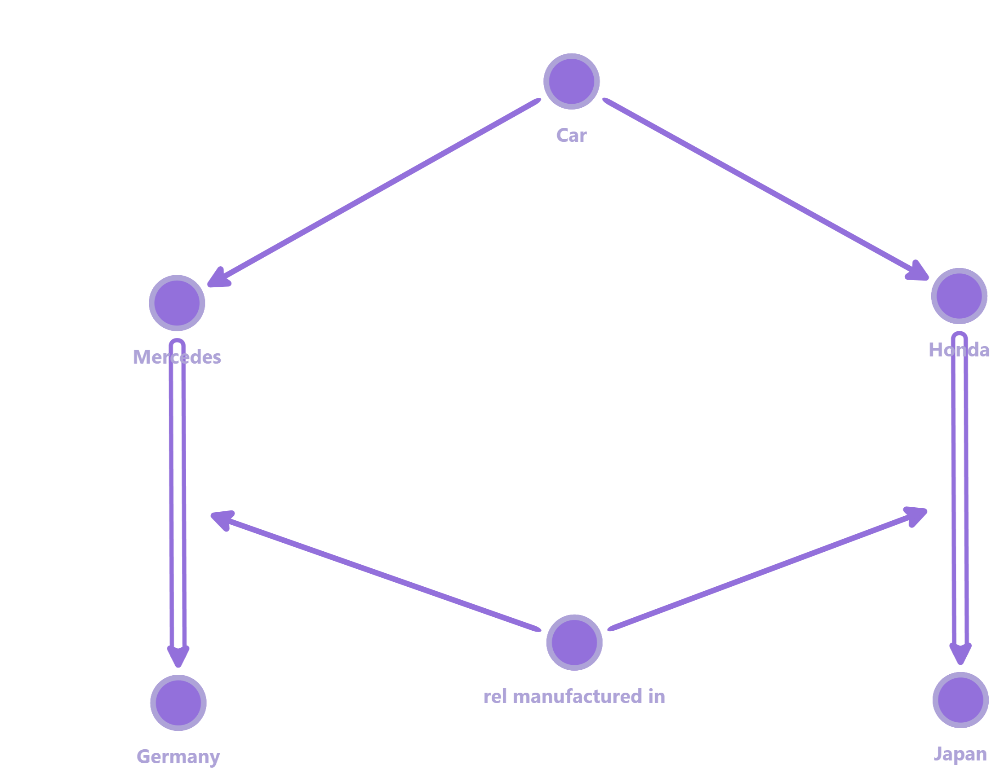
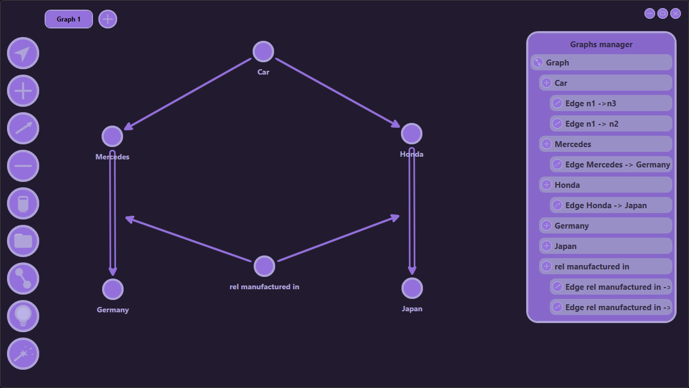

# GraphEditor

A visual graph editor application for creating, editing, and managing nodes and edges. Can be used to visualize small knowledge graphs.

*Graph visualization with nodes and edges*

## Features

- ✏️ Create and delete nodes
- 🔗 Add and remove edges between nodes
- 🎯 Move nodes to rearrange layout
- 📱 Interactive canvas interface
- 💾 Save and load graph data
- 🎨 Visual styling for different edge types

## User Interface

*Main application window with controls*